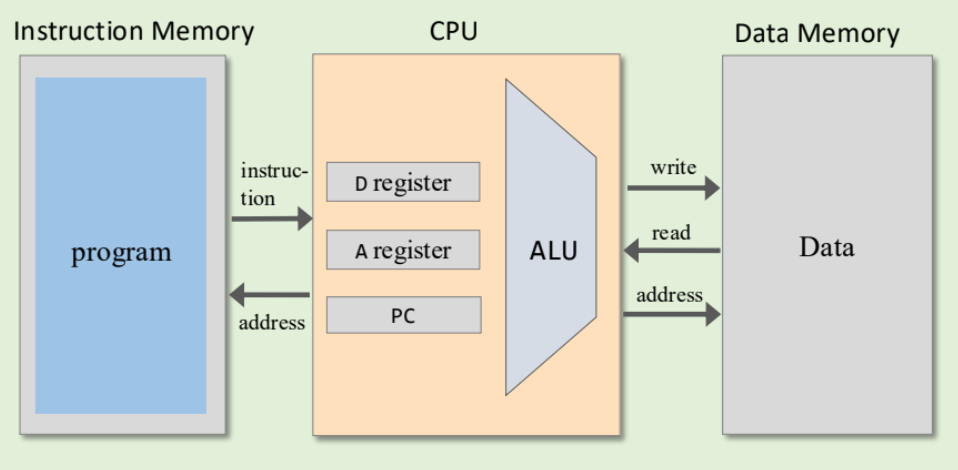
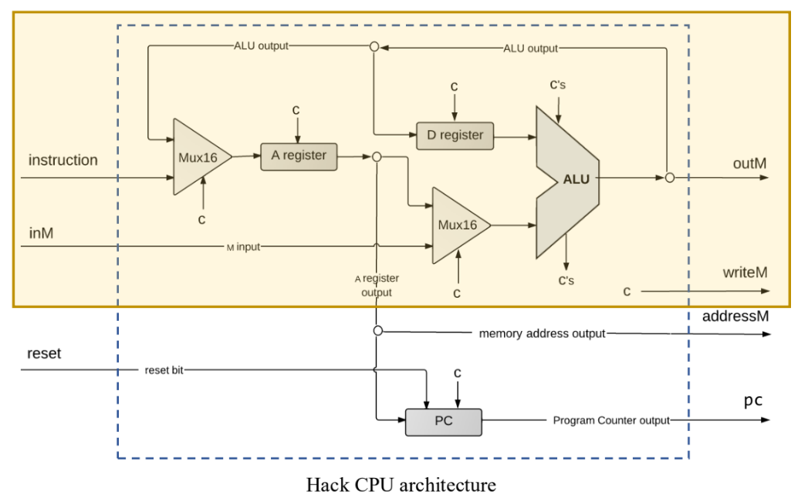

## About This Repository

This repository is based on the **Nand2Tetris Part One** course and contains my complete implementation of the "Hack" computer, built from the ground up starting with NAND gates and culminating in a fully functioning machine.

### Motivation

I've always been curious about how computers actually work at the physical level. This fundamental question has intrigued me for years, even before I began studying computer science.

To find answers, I studied Computer Architecture and Organization from various sources. When I finally had the opportunity to synthesize this knowledge practically, it was a remarkable moment, understanding how engineers transformed simple vacuum tubes into programmable machines was truly fascinating.

After gaining a solid theoretical foundation and reaching a point where I could confidently build a computer myself, I decided to take the Nand2Tetris course to apply my knowledge in a hands-on manner.

## How?

Computing is fundamentally about evaluating Boolean functions in an organized manner. These functions are processed within the computer according to architectural designs chosen by engineers. Boolean functions are computed using combinational and sequential circuits, where combinational circuits evaluate functions based purely on current inputs.

Every Boolean function can be expressed using at least one Boolean expression called the canonical representation (The Elements of Computing Systems, p.9). In other words, any Boolean function can be represented using the basic gates: AND, OR, and NOT. The number of Boolean functions that can be defined over n binary variables is 2^(2^n).

The NAND gate can construct all basic gates (AND, OR, and NOT), making it a **universal gate**: a gate capable of implementing any other gate and therefore any Boolean function. Since every Boolean function has a canonical form, the NAND gate can implement any Boolean function. The same principle applies to the NOR gate.

In fact, we could redesign this entire computer using only NOR gates, and it would work perfectly. As long as we use a universal gate, we can implement anything. And in our case, that "anything" is a computer: **a set of Boolean functions organized together**.

  <strong>The Universal NAND Gate</strong> 
  

## Machine Architecture

The Hack computer is built on **Harvard Architecture**, featuring two separate memories: one for instructions and one for data. These communicate with the CPU through dedicated buses.

The CPU communicates with instruction memory to fetch and execute instructions. In our implementation, this is ROM, so programs must be loaded beforehand, unlike traditional systems that store programs in RAM using operating systems and runtime tools. This design choice reflects the Hack computer's simplicity. However, it remains a stored-program machine, not a fixed-program one.

  <strong>Hack Computer Architecture</strong> 
  

The CPU fetches instructions from instruction memory using a unidirectional data bus and a separate address bus. The data memory uses a bidirectional bus, allowing the CPU to both read from and write to it. I/O peripherals are memory-mapped to specific locations, enabling the CPU to interact with them seamlessly.

## CPU Architecture

  <strong>CPU Architecture</strong> 
  

### Instruction Set

1. **A-Instruction (MSB = 0)**: Load the address specified in the lower 15 bits into the A register
2. **C-Instruction (MSB = 1)**: Execute a computation or control operation, decoded directly by the CPU

### Registers

- **A Register**: Stores memory addresses and can also hold data values
- **D Register**: Stores data for computations

### Data Flow Control

Two multiplexers manage data flow within the CPU:

- **First Multiplexer**: Determines the source for the A register. Either a new address from an A-instruction or a computed value from the ALU (which could be an updated address for jumps or data, since the A register can store both addresses and data)
- **Second Multiplexer**: Selects the ALU's second input. Either the value in the A register or data fetched from main memory

Control bits (denoted as `c` bits) configure these multiplexers and other CPU components according to the instruction decoding specifications.

### What I Implemented

### Logic Gates
**Implemented using only NAND gates:**
- NOT, AND, OR, XOR
- Mux, DMux
- Not16, And16, Or16
- Mux16, Mux4Way16, Mux8Way16
- DMux4Way, DMux8Way
- Or16Way

All logic gates are constructed exclusively from NAND gates built from simple P and N transistors that make digital computation possible. Many chips were implemented using previously built chips as building blocks.

### Combinational Chips
*Combinational chips perform Boolean functions instantaneously without depending on time or previous results.*

- **Half Adder**: Basic single-bit adder without carry input
- **Full Adder**: Single-bit adder with carry input and output
- **Add16**: Adds two 16-bit numbers
- **Inc16**: Increments a 16-bit number by one
- **ALU**: Performs computations based on a 6-bit control code and two 16-bit inputs, outputting results and control signals for the Program Counter

### Sequential Chips
*Sequential chips maintain state and depend on clock cycles.*

- **Bit**: Single-bit memory cell using a D flip-flop (primitive in this implementation since wire loops are prohibited)
- **Register**: 16-bit register constructed from individual bit chips
- **RAM8, RAM64, RAM512, RAM4K, RAM16K**: Memory modules with increasing capacity
- **Program Counter**: Manages instruction sequencing, can reset, increment, or jump to specified addresses

### Machine

- **CPU**: Fully functional processor that executes A and C instructions, utilizing the ALU and Program Counter for computation and control flow
- **Memory**: RAM with memory-mapped I/O for keyboard input and screen output
- **Computer**: Complete system integrating ROM32K for instruction storage, the CPU, and the Memory module. The CPU begins execution at reset, fetches instructions from ROM, executes them, and updates the Program Counter accordingly

---

*All images except the NAND gate truth table © Noam Nisan and Shimon Schocken*
